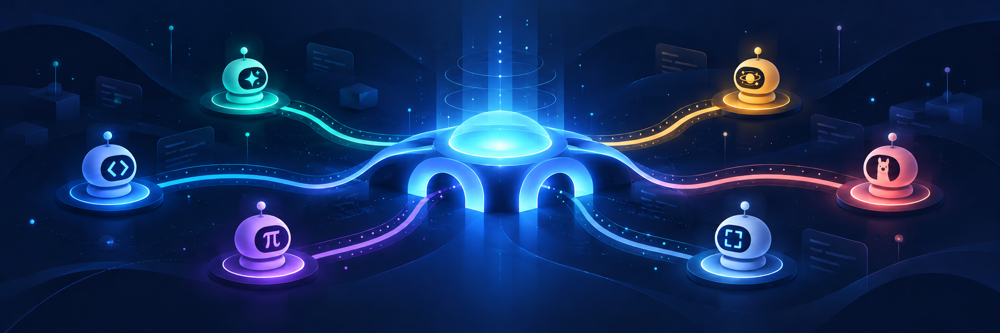
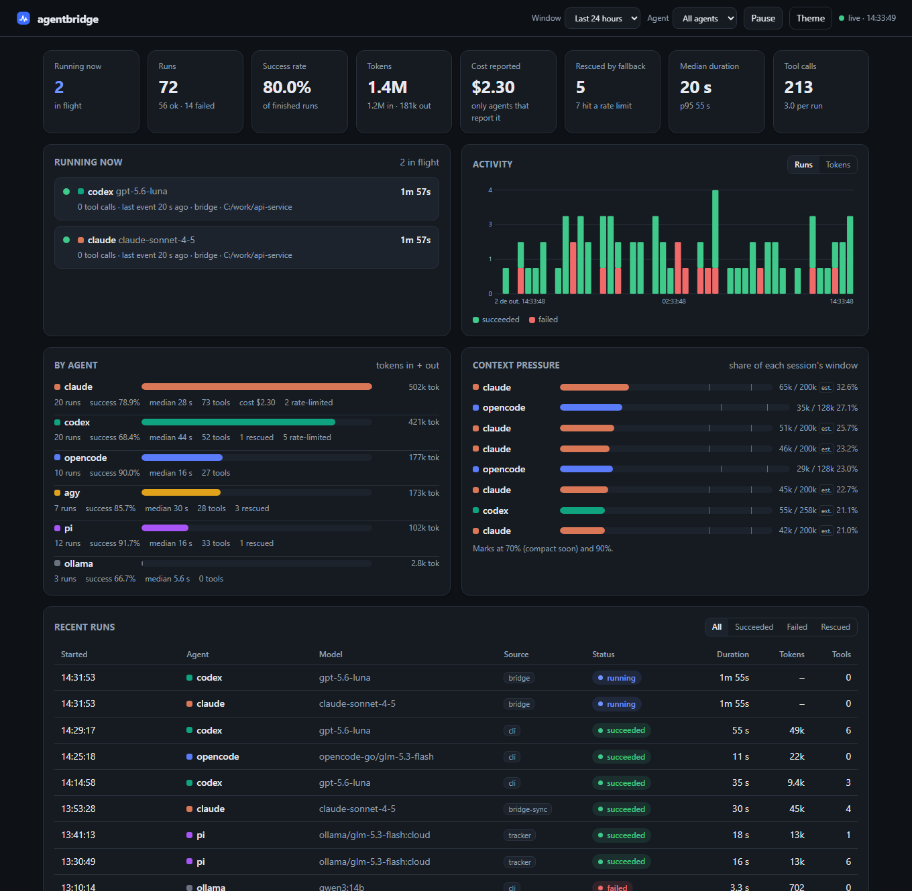

# agentbridge



**One interface for every coding agent on your machine.**
Drive **Claude Code**, **Codex**, **OpenCode**, **Antigravity CLI (`agy`)**, **pi**, **Cursor**, **Grok**, **Gemini**, **Devin**, **Agent Client Protocol (`acp`)** and local/remote **HTTP models (Ollama, vLLM, LM Studio...)** from the same CLI, library, MCP server and OpenAI/Anthropic-compatible proxy — using the logins you already have. **No API keys. No dependencies. No build step.**

```bash
ab ask claude   "Review src/auth.ts for security bugs"
ab ask codex    "Write tests for it"                      --permissions edit
ab ask agy      "Explain the failing build"               --model gemini-3.8-flash
ab race "Fix the flaky test" claude:haiku codex opencode  # first answer wins, the rest are cancelled
ab ask claude   "Big refactor" --fallback codex,pi        # out of tokens? the next agent takes over
ab checkpoint create "Before agent refactor"             # git hidden-ref snapshot for zero-risk rollback
```

> Node ESM · Node ≥ 22 · Windows, macOS, Linux · MIT · zero runtime dependencies
>
> 🤖 **Are you an AI Agent?** If you are an autonomous coding agent (Claude Code, OpenAI Codex, Antigravity, OpenCode, Pi, etc.) reading or working in this codebase, **read [README_AI.md](README_AI.md)** for direct operational instructions, architecture, CLI commands, and delegation patterns.



<sub>The built-in dashboard (`ab ui`), shown with sample data from `scripts/demo-data.mjs`.</sub>

---

## The Problem: The Fragmented Agent Dilemma

Every developer today is caught in the same frustrating trap:
- 😫 **Siloed Subscriptions:** You pay for Claude Code, OpenAI Codex, maybe Cursor, OpenCode, Antigravity, or run local Ollama. Each is brilliant at certain tasks, but they live in completely isolated walled gardens.
- 🤹 **Incompatible Harnesses & CLIs:** Every single tool has its own command-line syntax, conflicting flag formats, different config directories, incompatible session persistence, and weird permission models. Orchestrating them means maintaining a fragile spiderweb of shell scripts.
- 🚫 **Zero Interoperability:** Your agents cannot talk to each other. Claude cannot ask Codex to write tests. Cursor cannot delegate a heavy refactor to Claude. Codex cannot offload repetitive bulk processing to a free local Ollama instance.
- 🛑 **The 2:00 PM Wall (Rate Limit Lockout):** You are in deep flow. Suddenly: `429 Too Many Requests: Quota exceeded`. Your agent crashes. You lose your session context, open another terminal, copy-paste prompts by hand, and try to re-explain the codebase to a different model.
- 💥 **Manual Babysitting & Accidental Disasters:** Unrestricted agents running rogue bash commands, or subagents hallucinating and destroying working code without an instant undo button.

---

## The Solution: AgentBridge

**AgentBridge unifies all your AI coding agents into a single, cohesive super-system.**
Instead of managing 5 different CLIs and hitting brick walls, AgentBridge makes all your agents **interchangeable, collaborating building blocks**:

| The Frustration You Face | How AgentBridge Solves It |
|---|---|
| **Fragmented CLIs & APIs** | **One universal CLI (`ab`) & TypeScript API:** Call any agent with identical options, stream events, and structured results. |
| **Isolated Agents in Silos** | **Universal MCP Bridge:** Any agent can call any other agent as a subagent (`ask_claude`, `ask_codex`, `ask_opencode`, `ask_agy`, `ask_pi`, `ask_ollama`...) with granular permissions, timeouts, and session controls. |
| **Hitting 429 Token Walls** | **The Escalation Ladder ("A Escadinha"):** Seamless fallback chains (`--fallback codex,pi,ollama`). When one agent runs out of quota, the next steps in automatically. |
| **Wasting Expensive Tokens** | **Proactive Quota Routing:** Agents actively query token limits via `check_quota` or `ab quota` to intelligently delegate to cheaper or local models. |
| **Hedge & Compare Models** | **`fanout` & `race`:** Send tasks to multiple models in parallel; compare solutions or take the fastest answer. |
| **Locked Out of SDKs** | **Universal OpenAI/Anthropic Proxy (`ab serve`):** Drive any tool, IDE, or script through your existing agent subscriptions. |
| **Accidental Code Destruction** | **Zero-Accident Safety Lock (Trava de Segurança):** Safe `read-only` by default, with deliberate unlocking (`--permissions edit`). |
| **No Easy Undo on Broken Edits** | **Git Hidden-Ref Checkpoints:** Instant repository snapshots with zero branch pollution for atomic rollbacks (`ab checkpoint rollback`). |
| **Dependency Hell & Bloat** | **Zero Runtime Dependencies:** Pure Node.js & TypeScript. No bloat, instantaneous startup. |

---

## Quickstart (2 minutes)

**1. Requirements:** Node.js ≥ 22 and at least one of the agent CLIs installed **and logged in** (all optional — use what you have): `claude`, `codex`, `opencode`, `agy`, `pi`, or an Ollama server.

**2. Install**

Install globally via npm:
```bash
npm install -g @rodolfonobrega/agentbridge
```

Or run directly without installing:
```bash
npx @rodolfonobrega/agentbridge setup
```

Or clone from source:
```bash
git clone https://github.com/rodolfonobrega/agentbridge.git
cd agentbridge
npm ci
npm run build
npm link           # puts `ab` and `agentbridge` on your PATH
```

**3. Interactive Setup Wizard**

Run the interactive terminal wizard to auto-detect your CLIs and configure everything in seconds:

```bash
ab setup           # or: ab wizard
```

The wizard will:
- ✦ **Auto-detect** all installed agents (`claude`, `codex`, `opencode`, `pi`, `ollama`, `agy`)
- ✦ Guide you through choosing target agents, scope (`user` global vs `project`), and permission ceilings (`full` [default], `edit`, `plan`, `read-only`)
- ✦ Install the `agentbridge-delegate` skill so your agents can call each other as subagents
- ✦ Configure Codex MCP tool auto-approval so you aren't interrupted by repetitive prompts
- ✦ Connect local Ollama or OpenRouter endpoints
- ✦ Run `ab doctor` to verify that all integrations are 100% operational

**4. Check your setup**

```bash
ab doctor          # finds each CLI, checks logins, lists models, detects host MCPs
ab doctor --live   # also makes one tiny real call per agent
```

**5. Ask something**

```bash
ab ask claude "Reply with exactly: PONG"
ab ask codex  "Summarize this repo" --cwd ./my-project
ab run opencode "Explain main.js" --stream           # live events
```

**6. Use it from code**

```js
import { ask, run, fanout, race } from '@rodolfonobrega/agentbridge';

const r = await ask('claude', { prompt: 'Say hi', model: 'haiku' });
console.log(r.text, r.usage, r.sessionId);

// first accepted answer wins; the losers are aborted
const { winner } = await race(['claude:haiku', 'codex', 'opencode'], { prompt: 'Name three prime numbers' });
console.log(winner.agent, winner.text);

// ask several agents and keep every answer
const { results } = await fanout(['claude:haiku', 'codex'], { prompt: 'Review src/auth.ts' });
```

**7. Watch what is happening (optional)**

```bash
ab ui --open        # live dashboard on http://127.0.0.1:8788
```

**8. Let your agents delegate to each other**

```bash
ab install claude          # registers the MCP bridge (default permission ceiling: full)
ab install codex           # same for Codex
ab install opencode        # same for OpenCode (opencode.json)
ab install agy             # same for Antigravity
ab install all             # every one of the above that is installed
```

Install scope defaults to the current project (`--scope project`: writes `.mcp.json` and `.claude/agents` into the repo); pass `--scope user` to register globally instead.

Now, from inside any of them, you can say "ask claude to review this" or "have pi write the tests": the agent calls the `ask_<agent>` tools (`ask_claude`, `ask_codex`, `ask_opencode`, `ask_agy`, `ask_pi`, `ask_ollama`, ...).

> 🛡️ **The Safety Lock (Trava de Segurança):**
> - **Zero-Accident Default (`read-only`):** When you run `ab ask` or when an agent calls `ask_*`, the safety lock is active by default. The agent can inspect code and answer questions, but **cannot modify files or run destructive shell scripts**.
> - **Intentional Unlocking:** When you want the agent to write code, implement features, or run tests, simply unlock it with `--permissions edit` (or `--permissions full`).
> ⏱️ **MCP Timeouts (Zero 60s Cutoffs):**
> - **Protocol / Server-Level Timeout (300s Default):** The official MCP client SDK enforces a strict 60s network cutoff if a server omits `timeout`. AgentBridge installers (`ab install`, `ab setup`, `install-ide`) automatically write `"timeout": 300` into all client configs (Pi, Claude, Codex, OpenCode, Cursor, VS Code, Zed), ensuring long subagent analyses finish uninterrupted.
> - **Tool / Function Parameter (`timeout` / `timeoutSeconds`):** You or your subagent can pass `timeout: 600` inside `ask_*` / `dispatch_*` calls to grant child processes extra time for heavy batch tasks.
> - **Child MCP Servers:** `McpServerConfig.timeout` is fully preserved and forwarded across all adapters.
>
> 🌐 **Universal Skills (`.agents/skills`) & Conflict Prevention:**
> - Pi, Codex, OpenCode, and Antigravity all share the open **`.agents/skills/`** directory. Installing once covers all of them!
> - Within a single install run each skill destination is written at most once (per-process dedup in `writeSkill`, `src/cli/install.ts`), so `ab install all` produces exactly one copy per target.

---

## Everything it can do

### 1. Unified run API (library + CLI)
- `run()` (streaming async generator), `ask()` (final result), `fanout()`, `race()`.
- Identical options for every agent: `model`, `effort` (`low|medium|high|xhigh|max`, mapped per agent), `permissions` (`read-only|plan|edit|full`), `cwd`, `timeoutMs`, `signal`, `systemPrompt`, `jsonSchema`, `session`, `mcpServers`, `env`, `extraArgs`, `fallback`.
- Normalized events (`text`, `tool`, `usage`, `fallback`, ...) and a normalized result (`text`, `sessionId`, `usage`, `model`, `structured`, `fallback`).
- Typed errors: `NOT_INSTALLED`, `NOT_LOGGED_IN`, `TIMEOUT`, `ABORTED`, `BAD_OPTION`, `RATE_LIMITED`, `AGENT_FAILED`.
- Structured output: `jsonSchema` validates (and repairs, with a retry) the model's JSON.

### 2. Sessions
`new`, `ephemeral`, `continue` (by id or "latest for this cwd") and `fork` (where the agent supports it) — the same vocabulary for all agents.

### 3. Agents calling agents (MCP bridge)
- `ab bridge` is a stdio MCP server exposing `ask_<agent>`, `dispatch_<agent>` (async job), `wait_run`, `check_run`, `cancel_run`, `send_message`, and `checkpoint_create`/`checkpoint_rollback`/`checkpoint_list`/`checkpoint_diff` tools.
- **Subagent Roster & Lineage:** Tracks the full parent-child tree (`RunRecord.root`, per-subagent `parentId`/`parentToolId`/`tokens` in `subagents[]`, delegation depth via `AGENTBRIDGE_DEPTH`), aggregates tokens, and visualizes call trees in `ab ui`.
- **Caller × callee pairs are tested live:** every cross-direction among claude, codex, opencode and agy (including `agy → agy`), plus `claude ↔ pi` (`acceptance/pairs.test.mjs`, `agy.test.mjs`, `pi.test.mjs`).
- **Safety rules:** recursion depth guard, permission ceiling (a subagent can never exceed the caller), HMAC attestation of results, the attestation key is delivered only through the process environment (never on disk or argv).
- **Recursion guard:** `AGENTBRIDGE_MAX_DEPTH` caps delegation depth (default 2); at the cap the bridge refuses to spawn another agent with "Recursion guard: AGENTBRIDGE_DEPTH=N has reached max M" (`src/bridge/mcp.ts`).
- Forced child working directory (`AGENTBRIDGE_CHILD_CWD`) so a caller cannot redirect where a subagent works.

### 4. The Escalation Ladder ("A Escadinha") & Proactive Quota Intelligence

Never let rate limits or exhausted token quotas kill your momentum again. AgentBridge gives you a two-stage defense: **automatic cascading fallback ladders** and **autonomous proactive quota routing**.

#### 🪜 The Escalation Ladder ("A Escadinha")
Set up an intelligent multi-tiered cascade across different providers and compute tiers:

```
┌─────────────────────────────────────────────────────────────┐
│  Tier 1: Heavyweight Architects (Codex / Claude 3.7 Sonnet) │  Deep reasoning & architecture
└──────────────────────────────┬──────────────────────────────┘
                               │ (Approaching limit / 429)
                               ▼
┌─────────────────────────────────────────────────────────────┐
│  Tier 2: Fast & Efficient Workers (OpenCode / Pi / Gemini)  │  Rapid implementation & cleanup
└──────────────────────────────┬──────────────────────────────┘
                               │ (Approaching limit / 429)
                               ▼
┌─────────────────────────────────────────────────────────────┐
│  Tier 3: Zero-Cost Unlimited Local (Ollama / vLLM)          │  100% offline, private & free
└─────────────────────────────────────────────────────────────┘
```

Run it seamlessly from the CLI, API, or MCP tools:
```bash
# If Codex is rate-limited, Claude takes over; if Claude is limited, Pi or local Ollama finishes the job!
ab ask codex "Refactor the authentication flow" --fallback claude,pi,ollama:qwen2.5-coder:14b
```
HTTP 429/529, "usage limit", "quota exceeded", "credit balance too low", "overloaded"... become `RATE_LIMITED` (with `retryAfterMs`). The chain moves down the ladder to the next agent, reports `fallback: { used, attempts, contextLost }`, and safely **refuses to re-run** a task that already made edits under `edit`/`full` permissions.

#### 🧠 Autonomous Proactive Quota Delegation (Agent-to-Agent)
Why wait for a 429 error to crash your run? Agents can query their real-time quota window using the **`check_quota`** MCP tool (or `ab quota <agent>` CLI):

```json
// Tool Call: check_quota({ agent: "codex" })
{
  "agent": "codex",
  "usedPercent": 82,
  "remainingPercent": 18,
  "windowMinutes": 300,
  "resetAt": "2026-10-09T18:00:00.000Z",
  "okToProceed": true
}
```

**Real-world Prompt Pattern (Codex / Claude Subagent Quota Routing):**
> *"You are the Lead Engineer. Before implementing the test suite, check your remaining quota using `check_quota({ agent: 'codex' })`. If your remaining quota is above 15% (`usedPercent < 85`), spawn an `ask_codex` subagent with `permissions: 'edit'` to write the tests. If you have 15% or less quota remaining, gracefully step down the escalation ladder and delegate the task to local zero-cost Ollama via `ask_ollama(model: 'qwen2.5-coder:14b')` or `ask_pi`."*

This turns your AI agents into **frugal, self-aware resource managers** that preserve your expensive flagship tokens for high-leverage tasks while offloading boilerplate to local models!

- **Proactive Quota Probing & Pool Cooldown:** Automatically queries Anthropic OAuth usage APIs and Codex headers, rotating accounts or triggering cooldowns for credentials with $\ge 95\%$ quota usage.

### 5. Parallel workflows
`fanout` runs the same prompt on many agents and collects all answers; `race` returns the first accepted answer and cancels the rest. `--worktree` runs an agent in an isolated git worktree; `--max-cost/--max-tokens/--max-time` enforce budgets.

### 6. HTTP endpoints as agents
```bash
ab endpoint add vllm http://localhost:8000/v1 --model my-model
ab ask ollama "hello" --model qwen3:14b
```
Ollama is built in. Any OpenAI- or Anthropic-compatible base URL works, and is exposed to other agents as `ask_<name>`.

### 7. OpenAI / Anthropic compatible proxy
```bash
ab serve --port 8787        # loopback only by default
```
Point any OpenAI or Anthropic SDK directly at `http://127.0.0.1:8787`. Route with the model name: `claude/haiku`, `codex/gpt-5`, `agy/gemini-2.0-flash`, `pi/ollama/glm-5.3-flash:cloud`, `opencode/<provider>/<model>`, `ollama/<model>`. Full streaming support; limits answer HTTP 429 with `retry-after`. Pass `--token` (or env `AGENTBRIDGE_TOKEN`) to protect the server and dashboard with a bearer token; Agent mode (`/agent/v1`), which lets the model edit files, refuses to start without one (`src/server/agent.ts`).

**Python Example:**
```python
from openai import OpenAI
client = OpenAI(base_url="http://127.0.0.1:8787/v1", api_key="not-needed")
stream = client.chat.completions.create(
    model="claude/claude-3-7-sonnet",
    messages=[{"role": "user", "content": "Explain async generator"}],
    stream=True
)
for chunk in stream:
    print(chunk.choices[0].delta.content or "", end="", flush=True)
```

**TypeScript / Node.js Example:**
```typescript
import Anthropic from '@anthropic-ai/sdk';
const client = new Anthropic({ baseURL: 'http://127.0.0.1:8787', apiKey: 'not-needed' });
const res = await client.messages.create({
  model: 'claude-3-7-sonnet',
  max_tokens: 1024,
  messages: [{ role: 'user', content: 'Say hello!' }]
});
console.log(res.content[0].text);
```
See **[docs/PROXY.md](docs/PROXY.md)** for full documentation, cURL, LangChain, and Agent Sandbox Mode.

### 8. Telemetry, context policy and handoff
`ab ps`, `ab top`, `ab stats`, `ab context <session>`: live runs, token usage and context-window pressure per session, with warn/compact/hard thresholds, automatic compaction and `ab handoff <session> --to <agent>` to continue a conversation in a different agent. See [docs/TELEMETRY.md](docs/TELEMETRY.md).

### 9. Live dashboard (`ab ui`)
```bash
ab ui --open          # http://127.0.0.1:8788
```
A read-only local web UI over the telemetry agentbridge records: **runs in flight** (live timers), **success rate**, **tokens in/out**, **reported cost**, **runs rescued by fallback** and rate limits hit, median/p95 duration, activity over time (runs or tokens), per-agent breakdown, **context-window pressure** per session, top tools, where runs come from (CLI, proxy, MCP bridge, library), and a detail drawer per run (prompt, output tail, tool calls, files touched, error). Filter by time window, agent and status; dark/light theme. Everything the CLI, the proxy and the MCP `ask_*` tools run is recorded automatically. No dependencies, loopback only, never starts or cancels anything. See [docs/TELEMETRY.md](docs/TELEMETRY.md#dashboard).

### 10. Hooks, doctor, Claude Code integration
Lifecycle hooks, `ab doctor` diagnostics, and `ab install claude` (MCP registration plus relay subagents for Codex/OpenCode/Ollama).

### 11. Git hidden-ref checkpoints
```bash
ab checkpoint create "Refactoring auth module"
ab checkpoint list
ab checkpoint diff <checkpoint-id>
ab checkpoint rollback <checkpoint-id>
```
Instant, non-destructive snapshots saved under `refs/agentbridge/checkpoints/...` via an isolated temporary git index (`GIT_INDEX_FILE`). Never touches your primary `.git/index` or pollutes git branches. Full rollback restores both tracked files and removes newly created untracked files safely. Also exposed as MCP tools (`checkpoint_create`, `checkpoint_rollback`, `checkpoint_list`).

### 12. Process supervision & anti-deadlock safeguards
- **Bounded Tail Ring Buffer:** Agent standard error is collected in a circular 8 KiB ring buffer (`STDERR_TAIL_MAX_CHARS`), preventing OS pipe buffer overflows and pipe deadlocks while preserving critical error tails.
- **Cross-Platform Tree Kills:** `taskkill.exe /pid <pid> /T /F` on Windows (degrading to a SIGKILL of the leader alone if taskkill is unavailable) and process groups (`-pid` SIGTERM to SIGKILL) on POSIX to guarantee zero zombie child processes.

### 13. Dual-mode Codex execution
Supports standard batch CLI runs (`codex exec`) as well as persistent JSON-RPC 2.0 stdio server mode (`codex app-server`), minimizing cold-start overhead and maintaining stateful turn execution.

### 14. Multiple accounts & managed profiles (`ab account`)
```bash
ab account list [agent]
ab account add claude work --copy-current
ab account add claude personal --login
ab account use claude work
ab account quota claude
```
Complete account profile isolation inspired by Orca. Each account gets its own dedicated configuration directory (`CLAUDE_CONFIG_DIR`, `CODEX_HOME`, `PI_CODING_AGENT_DIR`), eliminating session collisions and leaked tokens. Seamlessly converts to a zero-friction pool for automatic round-robin rotation in `ab serve --accept-tos-risk`.

### 15. TDD auto-repair loop (`ab fix`)
```bash
ab fix claude "npm test" --prompt "Fix auth token expiration bug" --max-attempts 3
```
Automatic test-driven repair loop. Captures test failures in a bounded ring buffer, creates a git checkpoint, feeds stdout/stderr to the agent with `edit` permissions, verifies with the test command, and automatically rolls back if attempts are exhausted without passing.

### 16. Multi-agent review loop & consensus (`ab review`, `ab ensemble`)
```bash
ab review codex claude "Implement rate limiter" --max-turns 3
ab ensemble "Analyze performance bottleneck" claude codex agy --judge claude
```
Cross-model verification. Implementers write code, reviewers inspect generated git diffs under `read-only` permissions with structured JSON/Markdown verdicts, and ensemble runs allow parallel multi-agent plurality voting and synthesis.

### 17. DAG pipeline task orchestrator (`ab pipeline`)
Executes multi-step agent pipelines organized as Directed Acyclic Graphs (DAGs) with topological wave parallelization, optional checkpoints per wave, and automatic rollback on failure (opt-in with `--auto-rollback`).

### 18. Shared project memory (`ab memory`)
```bash
ab memory add "Always use strict TypeScript and zero runtime dependencies"
ab memory decision "state-management" "Use Zustand for UI state" --agent claude
ab memory list
```
Persistent project knowledge stored in `.agentbridge/memory.json`. Injects conventions and past architectural decisions directly into agent prompts.

### 19. Zero-friction MCP & IDE installers (`ab install <ide>`)
```bash
ab install cursor | vscode | zed | windsurf | claude-desktop | claude | codex | pi | agy | opencode | all
```
Installs the AgentBridge MCP server directly into your favorite editor or CLI with atomic JSON configuration merging.

---

## 🔒 Privacy & Telemetry: 100% Local & Zero Remote Tracking

> [!IMPORTANT]
> **Your data never leaves your machine.**
> - **Zero Remote Analytics:** AgentBridge has NO cloud telemetry, NO tracking pixels, NO PostHog/Segment/Google Analytics/Sentry.
> - **100% Local Filesystem Storage:** All run histories, token stats, context measurements, and checkpoints stay strictly on your local disk in `~/.agentbridge/`.
> - **Air-Gapped Dashboard:** The `ab ui` server binds strictly to loopback (`http://127.0.0.1`), enforces strict CSP headers, blocks DNS rebinding, and is completely read-only.
> - **Direct Provider Connections Only:** The only network traffic occurring in AgentBridge is the direct LLM API requests made by the underlying agent CLIs (Claude, Codex, Ollama, etc.) to the providers you have explicitly configured.

---

| Agent | Permissions enforced by | Sessions | Web Search / Network Access | How to Unlock Full Tools & Web |
|---|---|---|---|---|
| Claude Code | the CLI's own permission modes | new / continue / fork / ephemeral | `WebSearch`, `WebFetch` active across all modes | Works out of the box; use `--permissions full` for unrestricted shell/plugins |
| Codex | the CLI's sandbox modes | new / continue / fork / ephemeral | Sandboxed by default; network blocked in `read-only`/`edit` | Set `--permissions full` (unrestricted sandbox) |
| OpenCode | agentbridge + CLI | new / continue / fork / ephemeral | `webfetch`, `websearch` active across all modes | Set `--permissions full` for shell (`bash`) execution |
| Antigravity (`agy`) | agentbridge (private HOME, deny rules) | new / continue / ephemeral (no fork) | `execute_url` (web fetch & search) active across all modes | Set `--permissions full` for arbitrary shell execution |
| pi | agentbridge (tool denylist) | new / continue / fork / ephemeral | Connected by default (`tool_search` enabled) | Set `--permissions full` for full tool & extension suite |
| HTTP endpoints (Ollama, OpenRouter) | Direct API or harness (`claude`/`pi`) | emulated | Plain chat (no tools) by default; full tools with harness | Pass `--harness claude` or `--harness pi` to enable tools & web |
| Proxy (`ab serve`) | Client function calling | per request / session | Client functions supported; hosted server tools not available | Register a client-side search function tool |

> **Web Search, Tools & Offline Mode:** By default, AgentBridge applies strict sandboxing to protect your machine. For live internet research, web searches, or executing network commands, models require permission clearance or an execution harness. Conversely, to strictly isolate agents from the web (air-gapped / offline privacy mode), pass `--offline` in the CLI or `offline: true` in code/MCP. See **[docs/REFERENCE.md#web-search-tools-and-network-permissions-across-agents--modes](docs/REFERENCE.md#web-search-tools-and-network-permissions-across-agents--modes)** for the complete guide.

Full details, flags and caveats: **[docs/REFERENCE.md](docs/REFERENCE.md)**.

---

## Documentation

| Doc | What is in it |
|---|---|
| [README_AI.md](README_AI.md) | Dedicated operational guide for AI agents (architecture, delegation, full permissions, checkpoints) |
| [docs/REFERENCE.md](docs/REFERENCE.md) | Complete reference: every CLI command, option, event, error, agent and environment variable |
| [docs/PROXY.md](docs/PROXY.md) | The OpenAI/Anthropic compatible proxy |
| [docs/TELEMETRY.md](docs/TELEMETRY.md) | Telemetry, the dashboard, context policy, compaction, handoff |
| [docs/EXTENDING.md](docs/EXTENDING.md) | Adding a new agent CLI or HTTP provider |
| [docs/COMPARISON.md](docs/COMPARISON.md) | In-depth technical comparison: AgentBridge vs. Orca vs. T3 Code |
| [CONTRIBUTING.md](CONTRIBUTING.md) | How to contribute, run the tests, the review rules |
| [acceptance/ADAPTER_NOTES.md](acceptance/ADAPTER_NOTES.md) | Verified facts about each CLI (quirks, workarounds) |
| [SECURITY.md](SECURITY.md) | Threat model and how to report vulnerabilities |

## How it works

```
 your code / ab CLI / SDK via proxy / another agent (MCP)
                     │
              ┌──────▼───────┐   events, results, errors, sessions,
              │  agentbridge │   permissions, fallback, telemetry
              └──────┬───────┘
   ┌────────┬────────┼─────────┬────────┬─────────────┐
 claude   codex   opencode    agy      pi      HTTP endpoints
 (spawned CLIs using their own local logins)   (Ollama, vLLM, ...)
```

Each adapter is a small module that spawns the real CLI and translates its output into the shared event model. Nothing is faked: the test suite drives the real agents.

## Testing

```bash
npm test               # offline suites (no agent or login required)
npm run accept         # the full acceptance run: drives the real, logged-in CLIs you have installed
```

Live suites skip agents that are not installed. See [CONTRIBUTING.md](CONTRIBUTING.md).

## Terms of service and safety

agentbridge drives the CLIs with **your own consumer/subscription logins**. Providers may restrict automated use of those plans: use it for personal, local work, never expose the proxy to other people, and use API keys where your provider requires them. Agents can run commands and edit files — start with `--permissions read-only` and widen deliberately. See [SECURITY.md](SECURITY.md).

## Releases and publishing (maintainers)

The package is published to npm as [`@rodolfonobrega/agentbridge`](https://www.npmjs.com/package/@rodolfonobrega/agentbridge) (the unscoped name is blocked by npm's similarity rule against `agent-bridge`). The `ab` and `agentbridge` commands are unchanged.

```bash
npm run release -- patch      # or minor | major | X.Y.Z; --dry-run only validates
git push origin main --follow-tags
```

`npm run release` checks that git is clean, runs typecheck, build and tests, bumps `package.json`, adds a `CHANGELOG.md` entry, commits and tags `vX.Y.Z`. Pushing the tag triggers `.github/workflows/release.yml`, which re-runs the tests, checks that the tag matches `package.json`, publishes to npm with provenance and creates a GitHub Release with the changelog notes. CI (`ci.yml`) runs typecheck, build and tests on Linux, Windows and macOS with Node 22 and 24.

One-time setup: add a repository secret named `NPM_TOKEN` (an npm granular access token with read/write on the package, 2FA bypass enabled).

## Contributing

Issues and pull requests are welcome — new adapters especially. Start with [CONTRIBUTING.md](CONTRIBUTING.md) and [docs/EXTENDING.md](docs/EXTENDING.md).

## License

[MIT](LICENSE)
